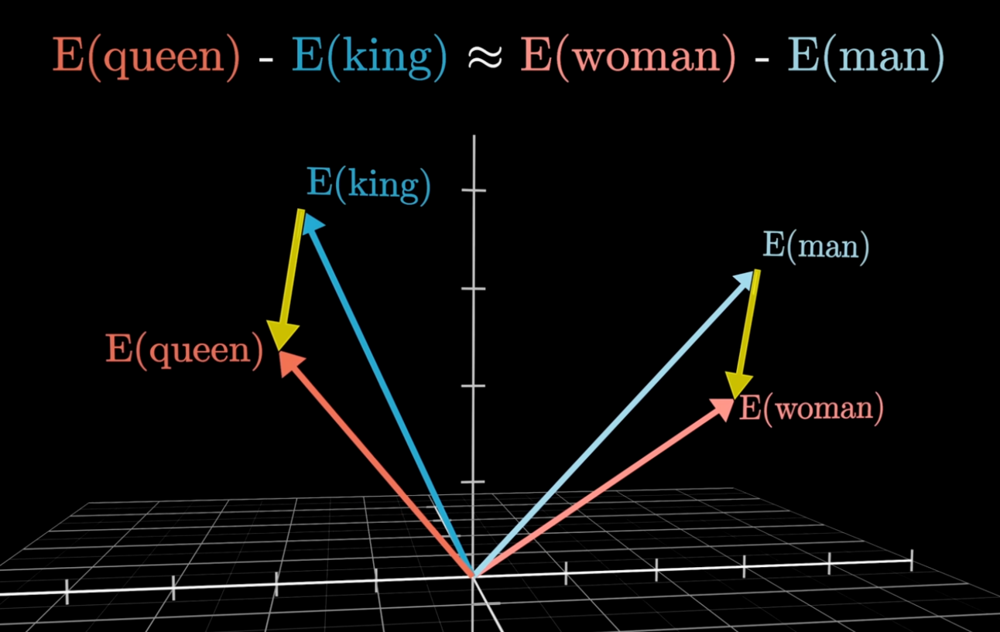

This is a fun one for me. Some of my biggest projects to date have been using Retrieval Augmented Generation (RAG) at scale.

This article assumes you know the basics of what a Large Language Model (LLM) is, and what they do.

## What:

Let’s start with what a RAG pipeline looks like. At its core, RAG combines the power of search with the reasoning capabilities of an LLM. 

1. **The user enters a query** - something like “What were the main risks highlighted in last month’s client report?”
2. **A retrieval function runs** - it searches your provided sources for the most relevant information.
3. **That context is passed to the LLM** - the model now has access to both the user’s question and relevant supporting info.
4. **The LLM generates an informed response** - grounded in your actual data.

## Why use RAG:

You're not just using the model's training data. You're giving it real context from your sources, helping to generate answers that are more accurate and relevant.

This lowers the chance of “hallucinations,” where an LLM confidently pretends to know something that it doesn’t.

Finetuning a model can be expensive, slow, and doesn’t always work. RAG scales better and is more likely to produce accurate answers. Finetuning still matters for shaping model behavior or adding general knowledge. But when I need a reliable chatbot for specific content, I always choose RAG.


In this post, I’ll cover the basics of how RAG works in practice. I won’t dive into code here, but I’ll share a technical article on building a RAG pipeline using Python in the next few weeks. Once that’s completed, you’ll see it linked below.

## What actually is RAG?

In practice, RAG is best thought of as 3 steps, with 3 core components. 

**Steps:** Preprocessing, Retrieval and Augmented Generation. 

**Components:** Embedding Model, a Vector Database and an LLM.

For now we’ll ignore any frontend considerations about how the pipeline gets its user input. You can imagine this as a command line tool, or a chatbot or whatever floats your boat.

That’s a lot of new terms. Let’s define them:

- **Embedding Model** - Turns text into vectors.
- **Vectors** - Numerical representations of text. Captures meaning and context.
- **Vector Database** - A collection of vectors that can be queried like a regular database. This can be as simple as a Postgres plugin, or a custom solution like ChromaDB or Pinecone.

## Preprocessing:

To perform RAG, you first need data to retrieve. In my projects, this has involved preprocessing thousands of files and keeping them updated live on a vector database. This is important, especially in Enterprise solutions, as we want the most up to date, reliable data.

But it doesn't have to be that complex. You can start with just one document as the source for a RAG system and that’s exactly how I started when figuring this out.

So what do our preprocessing steps look like? Using our example of a single document you’d:
 
- **Split the document into chunks** - keeps context manageable.
- **Clean each chunk** - removing noise like extra whitespace or irrelevant symbols.
- **Embed each chunk** - turning it into a vector using an embedding model.
- **Upload to a vector database** - storing each vector alongside its orginal content so it can be searched.

With that done you could move on to…

## Retrieval:

With the information now stored as vectors in a vector database, you can setup your retrieval steps.

1. **User inputs a query** – “What were the main risks highlighted in last month’s client report?”
2. **Query passed through the SAME embedding model** – it’s embedded just like all other vectors in your database.
3. **Similar vectors are retrieved** – the system finds vectors most similar to the user’s query.
4. **Context is returned** – the content linked to those vectors is used to inform the response.

I’ve had trouble explaining what “similar vectors” means here. It’s tough to describe. Like I explained earlier, vectors aren’t just numbers - they represent meaning and context. 

This diagram shows it clearly:



(Credit to 3blue1brown’s fantastic video on “How word vectors encode meaning.”)

Imagine these vectors as points in a complex graph. This makes it easier to see how meaning can be captured with math.

In this simplified example, the vectors for “man” and “woman” occupy similar spaces. So do “king” and “queen.” Mathematically, we can infer that these words are related.

**Here’s the interesting part:** the difference between “man” and “woman” is almost the same as the difference between “king” and “queen.” The yellow arrows, representing the differences, are nearly parallel and are similar in length.

**This means:** E(queen) - E(king) ≈ E(woman) - E(man)

**Rearranged:** E(queen) ≈ E(king) - E(man) + E(woman)

**Or in plain english:** If you have a King who isn’t a man but is in fact a woman what are they? A Queen.

This is how vectors capture meaning. Using the same idea, we retrieve similar context from our database by finding vectors close to the one created from the user’s input.

Pretty cool, yeah?

With context retrieved we can move on to…

## Augmented Generation

Now this part is the most simple. Simply take the context returned from retrieval and pass it to an LLM.

Usually, you’d do this by having a formatted prompt:

```python
f"""
Using this context:
{context}

Answer this:
{user_query}

Keep your answer concise. Only use the information provided. 
If no information is provided, simply state that you cannot answer 
the question due to lack of context in the database.
"""
```
By providing the context, and ensuring strict guidelines about adhering to the context we greatly improve the likelihood of an accurate answer. 

When the LLM receives this prompt, and returns the informed answer to the user, the pipeline is complete.

## Conclusion:

So now you know what RAG is, why it’s useful and how it works. As mentioned I’ll release a more technical blog on how to build a RAG pipeline in Python at some point in the next few weeks. 

You’ll find it linked here once it’s completed: ...