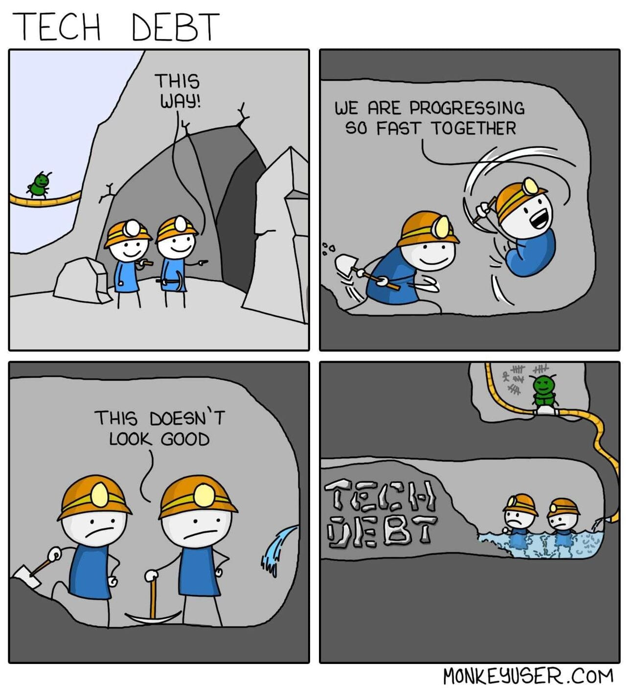

If you’re like me, when you first heard “Tech Debt” you might have thought someone hadn’t paid for their new PC. That’s not quite the case.

So, what is tech debt?

**Definition:** “Tech debt is the the build up of potential problems from shortcuts taken in a project.”

Let’s try to put it into perspective with an example.

**Situation:** You're working on a project with a tight deadline to present a Minimum Viable Product. Budgets become limited, but you need to impress stakeholders to secure more funding.

**Solution:** You cut a few corners. Maybe, you don’t document your code. You skip through testing or get ChatGPT to implement some functionality - without taking the time to understand it.

*This* is tech debt.

People will say there isn’t ever a reason to take on tech debt. These are the same people who think projects always ship on time and stakeholders never change their minds - in other words, out of touch.

At the end of the day, it’s sometimes needed. Plans change. Things take longer than expected. Schedules get tight.

In the situation above, you had little choice but to take shortcuts and accrue tech debt. But congratulations, you got funding and the project lives on. 🥳

BUT if the project just moves on without paying off the debt, without considering the mess left behind, things can go really wrong, really quick.

These problems occur when you treat tech debt like a payday loan — rushed, spur of the moment decisions with no real plan to repay. You should instead treat it like a mortgage. Planned, approved, and paid off structurally.

So, what should be the terms of your tech debt mortgage?

- **Plan your shortcuts** - Know what you’ll skip and when you’ll fix it. This keeps the debt visible and intentional, not accidental.
- **Get approval** - Talk to your project manager, agree on a clean-up plan. If it’s part of the project plan, it’s less likely to get buried later.
- **Make time to repay** - Write docs, add tests, understand the code. Treat it like paying back a loan. Small, regular repayments are better than defaulting.

The truth is, modern software moves fast. Deadlines, demos, and limited resources mean you’ll probably take on tech debt at some point, if you haven’t already. Just like buying a house, the majority of people need the loan — but you can be smart about how you manage it.

P.S. If this is happening to you all the time, there’s a good chance it’s not your fault. Especially now that you know how to approach it. It’s quite likely to be an organisational problem; poor planning or budgeting. In such a case, speak to your manager and raise the issue. A non-technical manager, or a manager that’s not super involved in the project, might not realise how much tech debt is being accumulated to meet deadlines.

---
**TLDR;** Tech debt happens. When it does, take it out knowingly, and pay it off sensibly.